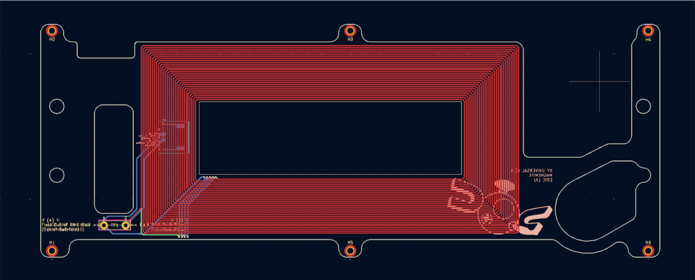

# Magnetorquer XY Board Characterization Analysis

The XY Magnetorquer board featuring coil traces (red) with cutouts for star tracker, PyCubed access, flex-board camera deployment, and flex hinges.

## Analysis Overview

This repository contains the analysis code for characterizing the XY Magnetorquer board's electrical, magnetic, and thermal properties. The analysis characterizes three key domains:

### 1. Electrical Properties Analysis

Base electrical characterization is performed at reference temperature T₀:

$$R_0 = \frac{V_{bat}}{I_{max}}$$

$$P_{max} = \frac{V_{bat}^2}{R_0}$$

For copper traces, resistance varies with temperature according to:

$$R(T) = R_0[1 + \alpha(T - T_0)]$$

where α = 0.00393 Ω/°C is copper's temperature coefficient of resistance.

### 2. Magnetic Moment Analysis

The magnetic moment μ is calculated using measurements of the magnetic field B at various distances r from the board centerline. The analysis uses the dipole approximation:

For a magnetic dipole along the z-axis:

$$\vec{B}(\vec{r}) = \frac{\mu_0}{4\pi}\left(\frac{3(\vec{\mu}\cdot\hat{r})\hat{r} - \vec{\mu}}{r^3}\right)$$

Which simplifies on the z-axis to:

$$B_z(z) = \frac{\mu_0\mu}{2\pi z^3}$$

Therefore, the magnetic moment can be extracted from field measurements:

$$\mu = \frac{2\pi}{\mu_0}Br^3$$

The analysis accounts for ambient fields through vector subtraction:

$$\vec{B}_{magtorq} = \vec{B}_{measured} - \vec{B}_{ambient}$$

### 3. Thermal Analysis

Temperature evolution follows an exponential heating model:

$$T(t) = T_\infty + (T_0 - T_\infty)e^{-t/\tau}$$

where:
- T₀ is initial temperature
- T∞ is final equilibrium temperature 
- τ is the thermal time constant

This affects the magnetic moment through temperature-dependent resistance:

$$\mu(T) = \mu_{max}\frac{I(T)}{I_{max}} = \mu_{max}\frac{R_0}{R(T)}$$

$$\mu(T) = \mu_{max}\frac{1}{1 + \alpha(T - T_0)}$$

## Analysis Outputs

1. **Property JSON File**
   - Calibrated model parameters
   - Reference conditions
   - Maximum ratings

2. **Interactive Thermal Analysis Plots**
   - T(t) time evolution
   - R(T) temperature dependence  
   - I(T) temperature derating
   - μ(T) moment temperature sensitivity

3. **Performance Projections**
   - 1-hour thermal equilibrium
   - Temperature extreme behavior (-50°C to 150°C)
   - Thermal stability margins

## Test Methodology

### Magnetic Field Measurements

Field measurements taken at r = [5cm, 10cm] from board centerline:

1. Record ambient field vector B̄ambient
2. Apply V = Vbat, measure B̄net at ±r 
3. Reverse polarity, repeat measurements
4. Calculate moment using:

$$\mu = \frac{2\pi}{\mu_0}\langle|\vec{B}_{net} - \vec{B}_{ambient}|\rangle r^3$$

where ⟨...⟩ denotes averaging over positions and polarities.

### Thermal Measurements

Temperature measurements under controlled conditions:
1. Board at thermal equilibrium with T = T₀
2. Apply V = Vbat at t = 0
3. Record T(t) until dT/dt ≈ 0
4. Fit exponential model to extract τ, T∞

Performance metrics are then derived through the temperature-dependent models above.